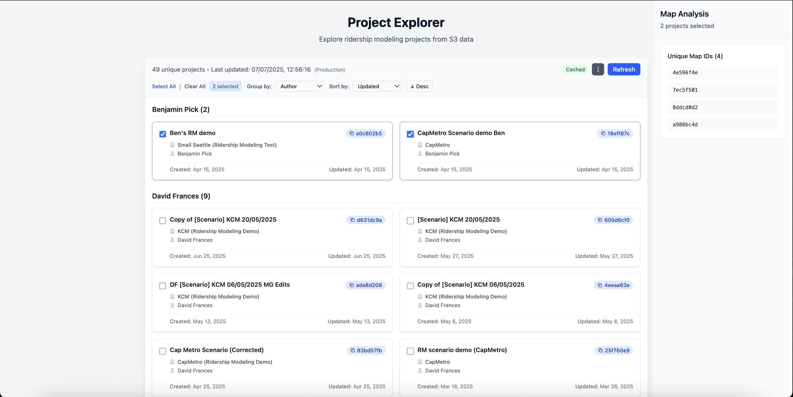

# Project Explorer



## Generating Project Data

The application reads ridership modeling data from S3 buckets. Data is generated using a Remix rake task called `dump_ridership_modeling_results` that exports all completed ridership modeling jobs to S3 in JSON format.

### Running the Data Export

**For local/staging data:**
Run from the Remix core subdirectory:
```bash
# Set the environment variable to use staging bucket
export RIDERSHIP_MODELING_S3_BUCKET=citymapper-cfc-ridership-modeling-eu-west-1-staging
rake 'dump_ridership_modeling_results'
```

**For production data:**
```bash
remix-cli ecs-run-cmd --cmd "APPLY_CHANGES=1 rake 'dump_ridership_modeling_jobs'" --application=core --environment=production-us --mode existing
```

### Data Format

The exported JSON should have the following structure:

```json
{
  "exported_at": "2025-01-01T12:00:00Z",
  "total_jobs": 14,
  "total_unique_projects": 7,
  "jobs": [
    {
      "id": "job_id",
      "request_payload": {
        "project_id": "project_id"
      },
      "map_id": "map_id",
      "status": "completed"
    }
  ],
  "unique_projects": [
    {
      "id": "project_id",
      "name": "Project Name",
      "agency_id": "agency_id",
      "agency_name": "Agency Name",
      "author_id": "author_id", 
      "author_name": "Author Name",
      "created_at": "2025-01-01T12:00:00Z",
      "updated_at": "2025-01-01T12:00:00Z"
    }
  ]
}
```

### S3 Configuration

The application expects data files in these S3 locations:

- **Staging**: `citymapper-cfc-ridership-modeling-eu-west-1-staging/ridership_modeling_dumps/`
- **Production**: `citymapper-cfc-ridership-modeling-eu-west-1-stagingproduction/ridership_modeling_dumps/`

## Running the Backend

### Prerequisites

- Python 3.8+
- AWS credentials configured (via aws-vault or environment variables)
- Access to the S3 buckets

### Setup

1. **Navigate to the backend directory:**
   ```bash
   cd backend
   ```

2. **Create and activate a virtual environment:**
   ```bash
   python -m venv venv
   source venv/bin/activate  # On Windows: venv\Scripts\activate
   ```

3. **Install dependencies:**
   ```bash
   pip install -r requirements.txt
   ```

4. **Configure environment variables:**
   Copy the example environment file and update as needed:
   ```bash
   cp .env.example .env
   ```

### Running

```bash
aws-vault exec production-remix-ops -- python main.py
```

The API will be available at `http://localhost:8000`

## Running the Frontend

### Prerequisites

- Node.js 18+ (recommend using nvm to switch from v12 to v22)
- npm or yarn

### Setup

1. **Navigate to the frontend directory:**
   ```bash
   cd frontend
   ```

2. **Install dependencies:**
   ```bash
   npm install
   ```

3. **Configure environment variables:**
   Copy the example environment file:
   ```bash
   cp .env.local.example .env.local
   ```

### Running

```bash
npm run dev
```

The application will be available at `http://localhost:5173`

---

**Note:** The UI includes an environment switcher that allows you to toggle between:
- **Local**: Uses staging S3 bucket data and redirects links to local Remix (`localhost:3000`)
- **Production**: Uses production S3 bucket data and redirects links to production Remix (`platform.remix.com`) 